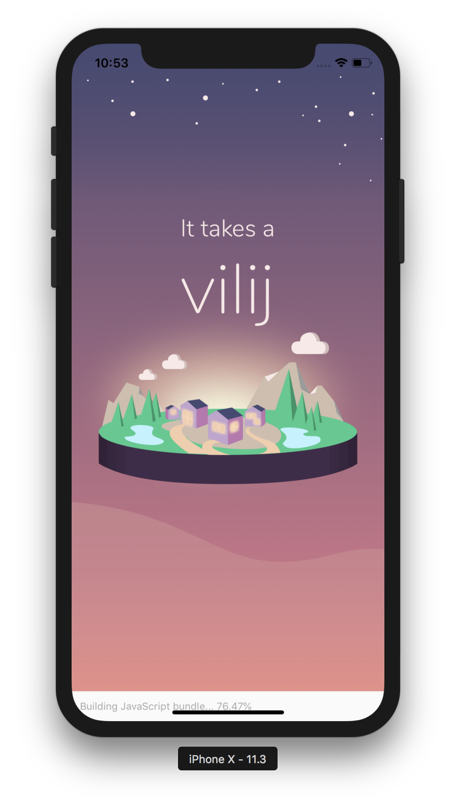
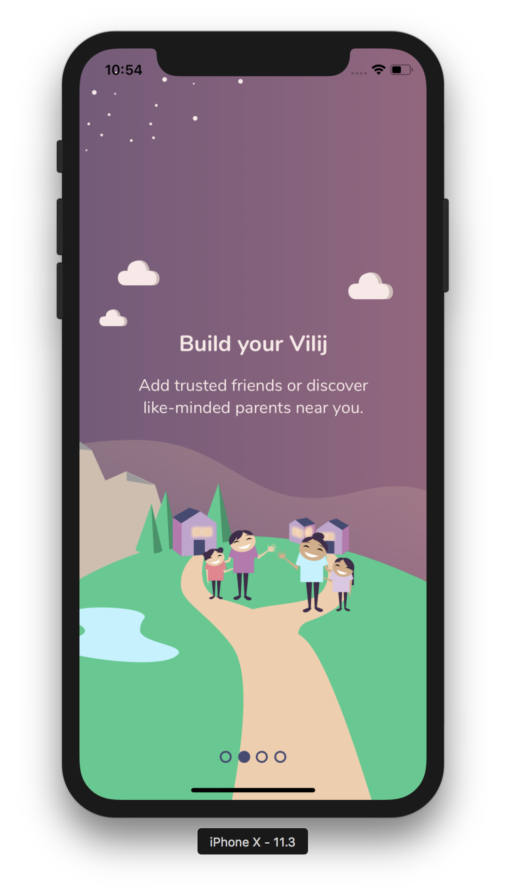
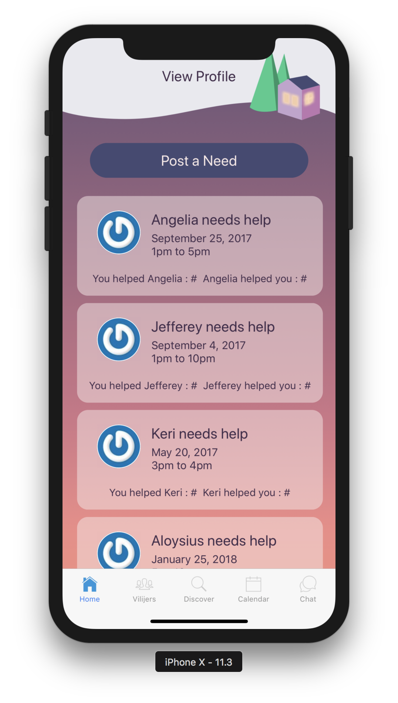
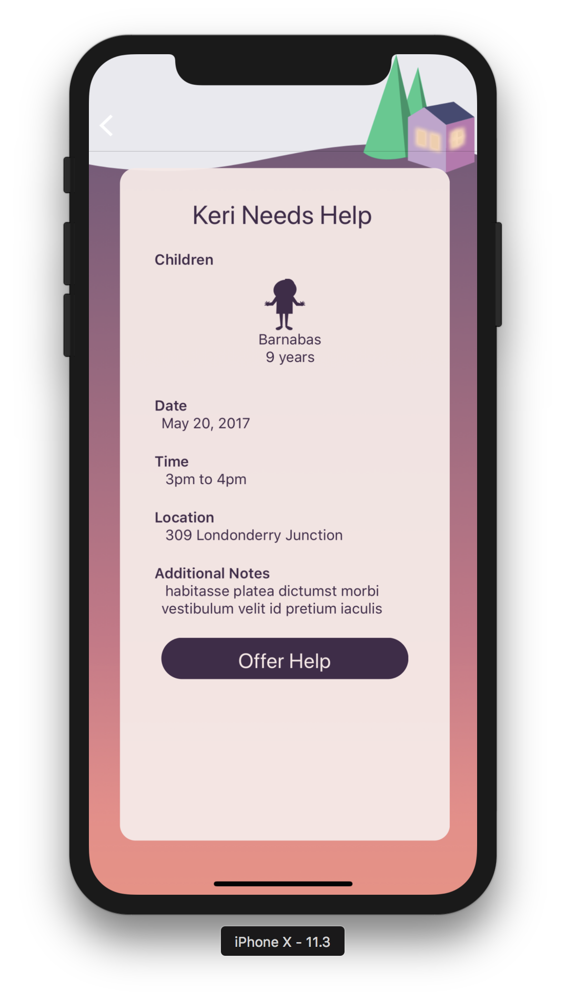

# Vilij React Native App 

React Native app that allows parents to discover and connect with other parents in the neighbourhood.

## Technologies

React Native, Redux, Expo, Firebase, Gravatar and Moment.js.

<h3>ASK</h3>

 In collaboration with UI/UX team, build a mobile application for a client in group environment.  The app is designed to help foster the growth of a community.  Vilij allows parents to discover and connect with other parents in the neighbourhood.  Users are able to post requests if they are in need of a babysitter for their children.  

<h3>RESULT</h3> 

React Native and Expo were used to build the app.  Data was stored using MongoDB. Firebase and Facebook were used for authentication. Profile pictures are rendered using Gravatar. Group performance was optimized by using Git for version control and collaboration.

